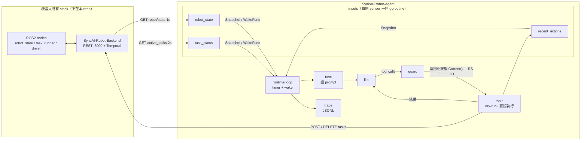
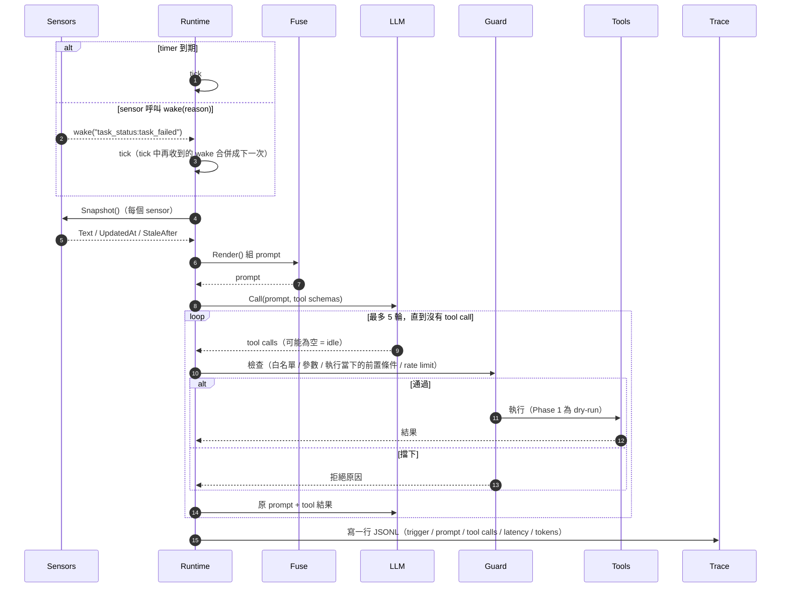
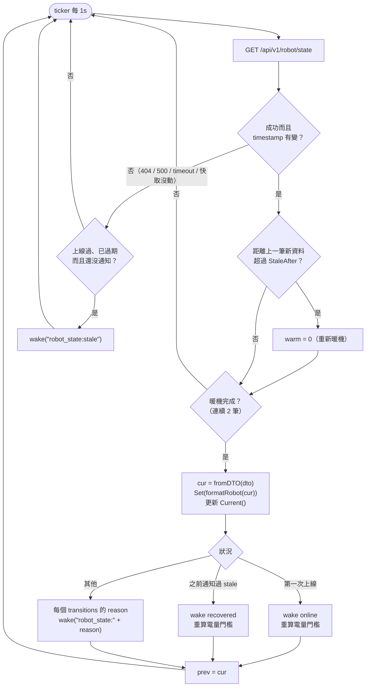
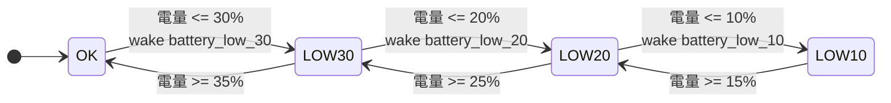
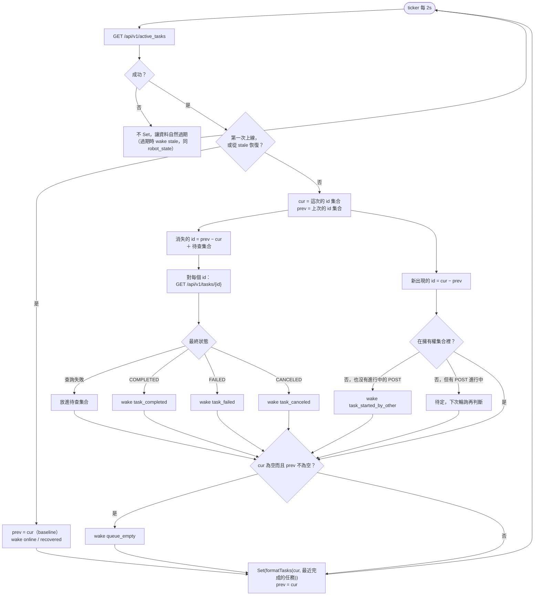
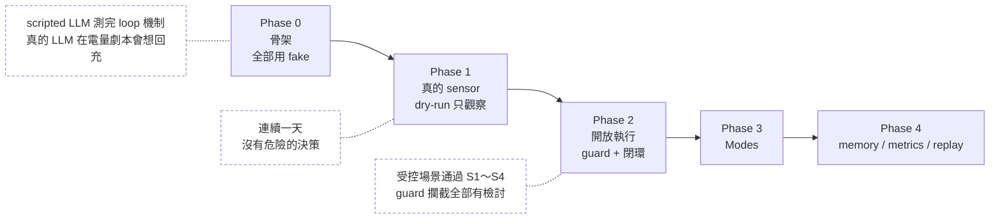

# Runtime Agent 初版計畫

在機器人上長駐執行的 background agent：持續觀察機器人與任務狀態，必要時透過既有的 backend / task 系統下達目標層級的任務。

本文件整理 2026-10-04 ～ 2026-10-05 的設計討論，並於 2026-10-10 依照 `robot_state` 的實作結果與設計檢討更新。架構參考 [OpenMind OM1](https://github.com/OpenMind/OM1)（Go runtime）的 cortex loop，但不引入 OM1 的程式碼或 plugin。

---

## 1. 範圍

**初版要做的**

- 一個最小的 agent runtime：sensor → 組 prompt → LLM → tool → 回饋。
- 三個 sensor：`robot_state`、`task_status`、`recent_actions`。
- 先只觀察（dry-run），確認判斷可靠後才開放實際執行。

**初版不做的**

- modes / transitions、lifecycle hooks、長期 memory、knowledge base（RAG）、hot reload。
- 直接接 ROS2（Go 需要 cgo）。初版所有資料都從 backend REST 取得。
- 任何低階控制（`cmd_vel`、姿態指令）。

---

## 2. 設計原則

1. **LLM 只做目標層級的決策，安全留在既有的 stack。**

   ```
   LLM agent (秒級) → guard → tools → backend / Temporal → task_runner / nav / driver (ms 級，安全在這)
   ```

   - agent 呼叫的是「派任務 / 取消任務 / 查詢」，不碰 `cmd_vel`。
   - agent 掛掉時，機器人本身仍然必須是安全的。

2. **每次 tick 都重新組 prompt，不帶對話歷史。** 狀態全部放在 sensor 裡，長時間運行 context 也不會膨脹。需要「記得做過什麼」的部分由 `recent_actions` sensor 提供。

3. **允許什麼都不做。** prompt 明確告訴 LLM「不需要動作就不要呼叫 tool」。background agent 大部分 tick 都應該是 idle。

4. **混合觸發，而且有上限。** 平常用低頻 timer（5～30 秒）；sensor 偵測到重要的狀態轉變時，透過 `WakeFunc` 立即喚醒。喚醒會被合併，但仍受最短間隔與每小時預算限制（見 4.3），避免抖動的 sensor 讓 LLM 呼叫暴增。

5. **guard 用型別化的資料，不解析文字。** sensor 的 `Snapshot().Text` 只給 LLM 看；guard 透過具體 sensor 的 getter（例如 `RobotState.Current()`）取得資料，而且是在**執行 tool 的當下**讀取，不沿用 tick 開始時的 snapshot。

6. **資料過期本身就是一種狀態。** 來源沉默超過 `StaleAfter` 時，prompt 會明確顯示 `STALE` / `NO DATA`，並主動喚醒一次。

7. **讓情況更安全的動作永遠可以做。** 取消 / 暫停任務不受 ESTOP、STALE、非 AUTO 等前置條件限制；只有會讓機器人動起來的動作需要過完整的 guard。

---

## 3. 從 OM1 學到什麼

| OM1 的做法 | OM1 位置 | 在本專案的對應 |
|---|---|---|
| Sensor 只保留最新狀態並轉成文字（`FormattedLatestBuffer`） | `internal/inputs/sensor.go` | `Sensor.Snapshot()` + `inputs.Latest` |
| timer + `TriggersTick()` 混合觸發 | `internal/runtime/runtime.go` `runCortexLoop` | timer + `WakeFunc(reason)` |
| 每次 tick 重組 prompt（persona / 規則 / 時間 / 觀測 / 可用動作） | `internal/fuser/fuser.go` | `runtime/fuse.go` |
| MCP 多輪 resolve：最多 5 輪、每個 tool 10s timeout、併發上限 5、成功的 call 不重跑 | `internal/mcp/orchestrator.go` `Resolve` | `runtime` 的 tool loop |
| Connector 介面 + registry + JSON schema | `internal/actions/action.go` | `tool.Tool` |
| 每個長駐 goroutine 都會 recover panic 並重啟 | `internal/backgrounds/orchestrator.go` | `runtime/supervise.go` |

**刻意和 OM1 不同的地方**

- **重啟要有 exponential backoff。** OM1 的 `runLoop` 在 `Run` return 後立刻重跑；如果 `Run` 一直立即失敗，會變成 busy loop。
- **Sensor 介面只有 `Name` / `Run` / `Snapshot` 三個方法。** OM1 有 `Listen` / `Poll` / `RawToText` / `FormattedLatestBuffer` / `Stop` 五個。推送和輪詢的差別放在各自的實作裡處理。
- **Wake 是 `Run` 的參數，型別是 `WakeFunc(reason)`。** 不需要另外開 goroutine 把各 sensor 的 channel 合流，而且 reason 可以直接寫進 trace。
- **結尾的 prompt 不是 "What will you do next?"。** 那句適合一直互動的對話型機器人，不適合 background agent。
- **閉環。** OM1 是開放式的：動作送出之後就不管了。本專案把任務狀態當成 sensor，任務結束或失敗時會喚醒 agent。
- **會改變狀態的 tool 依序執行、不自動重試。** OM1 的併發上限 5、成功的 call 不重跑，只適用於唯讀 tool。`POST /tasks` 併發或逾時重試都可能重複派出同一個任務。

---

## 4. 架構

```
            ┌─────────────── sensors (各自一個 goroutine，由 supervise 管理) ───────────────┐
            │  robot_state      task_status      recent_actions      operator_inbox        │
            └───────┬──────────────┬─────────────────┬─────────────────┬──────────────────┘
                    │ Snapshot()   │                 │                 │
                    │ WakeFunc ────┴─────────────────┴─────────────────┘
                    ▼
 timer(interval) ─► runtime loop ── single-flight（同時只跑一個 tick，多次喚醒合併）
                    │               + 最短間隔 / 每小時預算 / tick deadline（4.3）
                    │
                    ├─ fuse：persona + rules + 時間 + 各 sensor 的 Render()
                    ├─ LLM（function calling）
                    ├─ tool loop：guard → 執行（dry-run / 實際）→ 結果餵回 LLM，最多 5 輪
                    │             唯讀 tool 可併發；會改變狀態的 tool 依序執行、不重試
                    └─ trace：每次 tick 寫一行 JSONL
```

### 4.1 元件關係



### 4.2 一次 tick 的流程



### 4.3 頻率、成本與失敗處理

single-flight 只會合併「同時」進來的喚醒；sensor 持續抖動時，tick 仍會一個接一個跑。因此 runtime 另外有這些限制：

| 項目 | 預設 | 說明 |
|---|---|---|
| 最短 tick 間隔 | 2s | 間隔內的喚醒延後到間隔結束，並合併成一次 |
| 每小時預算 | 呼叫次數 / token 上限，放進 config | 超過時只剩 timer tick；trace 記錄 `budget_exceeded` |
| 單次 tick deadline | 30s | 包含所有 LLM 呼叫與 tool loop；逾時就結束這次 tick |
| LLM 錯誤 | — | 記 log、跳過這次 tick；連續失敗時對 LLM 呼叫做 exponential backoff，sensor 不受影響 |

LLM 無法使用時，agent 只是不做決策，機器人的安全不受影響（設計原則 1）。

---

## 5. 專案結構

```
cmd/
  main.go                  // 組裝：讀 config、建 sensors / tools / llm、啟動 runtime
internal/
  inputs/
    sensor.go              // Sensor interface、Snapshot、Latest
    robot_state.go         // robot_state sensor
    task_status.go         // task_status sensor
    recent_actions.go      // Phase 1（dry-run 的動作也要記）
    fake.go                // 依劇本變化的假 sensor（Phase 0 測試用）
  backend/
    client.go              // backend REST client（共用）
    robot.go               // GET /api/v1/robot/state 的 DTO
    task.go                // active_tasks / tasks/{id} 的 DTO
  runtime/
    runtime.go             // loop：timer + wake、tick、shutdown
    fuse.go                // 組 prompt
    supervise.go           // recover + backoff
  llm/
    llm.go                 // interface
    scripted.go            // 照劇本回傳 tool call 的假 LLM（測試用）
  tool/
    tool.go                // interface + registry
    tasks.go               // 第 10.3 節的 tool（get / dispatch / cancel / pause / resume）
    notify.go              // notify_operator（初版只寫 log）
    guard.go               // Phase 2
    dryrun.go              // 只記 log、不執行的 wrapper
    owned.go               // agent 送出的 task id 集合（寫檔保存，重啟後仍在）
  trace/
    jsonl.go               // 每次 tick 的決策紀錄
docs/
  runtime-agent-plan.md    // 本文件
```

---

## 6. 核心介面：`internal/inputs/sensor.go`

```go
type WakeFunc func(reason string)

type Sensor interface {
	Name() string
	Run(ctx context.Context, wake WakeFunc) error
	Snapshot() Snapshot
}

type Snapshot struct {
	Text       string        // 給 prompt 的一到兩行文字
	UpdatedAt  time.Time     // 本程式最後一次收到「新」資料的時間
	StaleAfter time.Duration // 0 = 永不過期
}
```

- `Snapshot.Render(name, now)` 統一處理 `NO DATA` / `STALE` 的格式，各 sensor 不用自己實作。
- `Latest` 嵌入 sensor 後就有 `Snapshot()`；在 `Run` 裡呼叫 `Set(text)` 更新。
- `Run` 遇到暫時性錯誤（HTTP 失敗等）不回傳 error，只是繼續執行，交給 STALE 機制處理。只有無法恢復的錯誤才回傳 error，由 runtime 以 backoff 重啟。
- guard 需要的 sensor 另外提供 `Current() (T, bool)`。資料還沒暖機完成或已經過期時回傳 `ok == false`，guard 必須把它當成「擋下所有會讓機器人動作的任務」。

**Sensor 設計原則**

1. 只放影響決策的資料。
2. 給語意，不給原始值（例如放 `pose available`，不放 TF 是否存在）。
3. 新鮮度一定要標示，而且分兩層：整個 sensor 的 STALE 代表來源斷了；個別欄位的問題由 sensor 自己寫進 Text。
4. Wake 只在狀態**轉變**時觸發（edge-triggered），必要時加 hysteresis。
5. 第一次上線和從 STALE 恢復時，只建立 baseline 並發一次 `online` / `recovered`，不把「和空狀態或斷線前的差異」逐一當成轉變。完整狀態已經在 Text 裡。

---

## 7. 資料來源：backend REST

初版所有 sensor 都從同機器上的 backend（`SyncAI-Robot-Backend`，port 3000）讀取：

| 用途 | Endpoint | 說明 |
|---|---|---|
| 機器人狀態 | `GET /api/v1/robot/state` | 來源是 `<robot_id>/robot_state` topic（1 Hz） |
| 執行中的任務 | `GET /api/v1/active_tasks` | 來源是 Temporal；有短暫快取，回應附 `as_of` |
| 單一任務狀態 | `GET /api/v1/tasks/{id}` | 包含每個 step 的狀態 |
| 派任務 / 取消 / 暫停 / 繼續 | `POST /api/v1/tasks`、`DELETE /api/v1/tasks/{id}`、`POST .../pause`、`POST .../resume` | Phase 2 才開放 |

**選擇走 backend 而不是直接接 ROS2 的原因**

- 任務狀態在 Temporal 裡，backend 是唯一的來源。
- Go 接 ROS2 需要 cgo（rclgo），初版不值得。
- 將來 `robot_state` 如果需要更低延遲或更多欄位，再改成直接訂閱 ROS（例如透過 zenoh bridge），介面不用變。

---

## 8. Sensor 設計

### 8.1 `robot_state`

**已確認的資料特性（直接影響實作）**

| 特性 | 來源 | 影響 |
|---|---|---|
| backend 的 `RobotRepo` 只快取最後一則訊息；node 掛掉後 REST 仍然會一直回 200 | backend `repositories/robot/robot.py` | `UpdatedAt` 必須用「payload 的 `timestamp` 最後一次前進時的本機時間」，不能用 HTTP 成功的時間 |
| 404 只代表 node 從沒發布過，或 backend 剛重啟 | backend `routers/robot.py` | 404 視為 `NO DATA`，不是錯誤 |
| `timestamp` 單位是秒、整秒精度、1 Hz | `syncai_common/msg/RobotState.msg` | `StaleAfter` 設為 5 秒 |
| `motor_status.timestamp` 不在 REST 白名單裡 | backend `routers/robot.py` | **從 REST 看不出 driver 中途掛掉。** 只能偵測 `motor_status` 為空（driver 從未啟動）。Text 不可以宣稱 driver 是健康的 |
| driver 沒回報時 `low_level_mode` 也是 PPO / STAND | `RobotLowLevelMode.msg` | `motor_status` 為空時，`fromDTO` 把 `Motion` / `Policy` 強制設為 UNKNOWN，不能當成 STAND |
| `motion` 的值是 STAND / LOCOMOTION / LIE_DOWN / DAMPING / ESTOP / UNKNOWN（MPC 也會落在 UNKNOWN） | backend `RobotLowLevelMode` | ESTOP / DAMPING 一定要喚醒 |
| `localization_valid` 只代表 TF 存在，不代表定位品質；false 時 pose 是全零的佔位值 | `RobotState.msg`、workspace CLAUDE.md | 文字寫 `pose available`，不寫 `localized`；定位品質要看 `relocalize_check` |
| `mode` 在 robot_state node 第一次拿到 `get_mode` 結果之前固定是 AUTO | `internal/backend/robot.go` 註解 | 剛啟動的前幾秒，mode 可能不準。暖機（2 筆）只能部分緩解，見第 12 節 |
| `state` 的 CHARGING 永遠不會出現，WARNING 目前只代表低電量 | `RobotStatus.msg` | 不提供「充電中」給 LLM，只提供電量 % |
| `theta` 是角度（backend 已從 yaw 弧度轉換） | backend `routers/robot.py` | 直接使用 |

**檔案內的分工**

| 部分 | 職責 | 是否為純函式 |
|---|---|---|
| `Run` / `poll` | 每秒輪詢、判斷 timestamp 是否前進、暖機、`Set` / `wake`、偵測過期 | 否 |
| `fromDTO(dto, cfg) RobotStatus` | JSON → 型別化狀態 | 是 |
| `transitions(prev, cur, battNotify, cfg) ([]string, int)` | 回傳要 wake 的原因，以及更新後的電量通知門檻 | 是 |
| `formatRobot(cur, cfg) string` | 產生給 LLM 的文字 | 是 |
| `Current() (RobotStatus, bool)` | 給 guard 使用（加鎖）；還沒暖機或已經過期時 `ok == false` | — |

**`Run` 的行為**

1. 每 `PollInterval`（1s）呼叫一次 `GetRobotState`。
2. 失敗（404 / 500 / timeout），或 `timestamp` 沒變：不呼叫 `Set`，讓資料自然過期；**過期的那一刻 wake 一次 `stale`**（只在上線過之後）。
3. `timestamp` 有變（用 `!=` 判斷而不是 `>`，時鐘往回調也不會卡住）：
   - **暖機**：要連續收到 `WarmupSamples`（2）筆新資料才開始回報。兩筆新資料之間隔超過 `StaleAfter`（第一次啟動、斷線恢復、node 重啟）就重新暖機。這可以擋掉「node 早就死了、backend 還在回最後一筆快取」的情況。
   - 暖機完成後：`fromDTO` → `Set(formatRobot(cur))` → 更新給 guard 的 `Current()`。
   - 第一次上線：只 wake `online`，電量通知門檻從目前電量開始算（不另外發 `battery_low_*`）。
   - 從 stale 恢復：只 wake `recovered`，斷線前後的差異不逐一喚醒；電量通知門檻同樣重新計算。
   - 其他情況：依 `transitions` 的結果逐一 wake `robot_state:<reason>`。
4. `prev`、暖機計數等欄位只在 `Run` 的 goroutine 裡讀寫；`Current()` 讀的是另一個加鎖的欄位。



**電量門檻的 hysteresis**



電量在 19%、20% 之間來回跳時，狀態會停在 `LOW20`，不會重複觸發 wake。一次跨過多個門檻（例如 25% 直接掉到 9%）只發最低的那個（`battery_low_10`）。

**Wake 條件**

| reason | 條件 |
|---|---|
| `online` | 暖機完成後的第一筆資料 |
| `mode_changed` | `Mode` 改變 |
| `estop` / `damping` | `Motion` 變成 ESTOP / DAMPING |
| `motion_unknown` | `Motion` 變成 UNKNOWN（包含 driver 不再回報、被強制設為 UNKNOWN 的情況） |
| `pose_lost` / `pose_available` | `PoseValid` 改變 |
| `map_changed` | `Map` 改變 |
| `battery_low_30` / `_20` / `_10` | 電量**往下**跨過門檻（`<=`）；回升到門檻 + 5% 以上（`>=`）才重新啟用。`syncai_robot_state` 的 <20% / >25% 需確認邊界是否一致 |
| `motor_fault` | 出現新的 `error != 0` 關節 |
| `motor_hot` | 出現新的過熱關節（`>= MotorHotC`） |
| `motors_missing` | `motor_status` 從有資料變成空 |
| `stale` / `recovered` | 來源過期 / 恢復 |

STAND ↔ LOCOMOTION ↔ LIE_DOWN 這類一般的動作變化**不**喚醒；狀態仍然會出現在下一次 tick 的 Text 裡。

**文字範例**

各欄位以 `; ` 分隔。每一種異常都直接寫出「不該做什麼」。

```
robot_state: mode AUTO; motion LOCOMOTION; pose (3.2, -1.0, 90°) on map "dp1f"; moving 0.40 m/s; battery 18% (LOW); wifi -62 dBm; 12 motors ok.
robot_state: mode AUTO; motion ESTOP — robot is emergency-stopped, do not issue any task; pose (3.2, -1.0, 90°) on map "dp1f"; battery 76%; 12 motors ok.
robot_state: mode AUTO; motion UNKNOWN — do not issue motion tasks; pose NOT available on map "dp1f" — do not issue MOVE tasks; battery 76%; motor telemetry missing — driver_manager may be down.
robot_state: mode MANUAL — agent must not act; motion STAND; pose (0.0, 0.0, 0°) on map "dp1f"; battery 64%; 12 motors ok.
```

不放進文字的資料：`z`、SSID、每個馬達的溫度（只列出異常的關節）。`policy` 只在不是 PPO 時才顯示；速度低於 0.05 m/s 時不顯示；`wifi` 在 RSSI 為 0（還沒收到資料）時不顯示。

### 8.2 `task_status`

**已確認的資料特性**

| 特性 | 來源 | 影響 |
|---|---|---|
| 沒有推送，只能輪詢 | backend `routers/task.py` | 每 2 秒輪詢 `active_tasks`，`StaleAfter` 設為 10 秒 |
| **任務結束後會從 `active_tasks` 消失** | 同上 | 必須和上一次的 id 集合比對：有 id 消失，就查 `GET /tasks/{id}` 取得最終狀態 |
| PAUSED 的任務在 `active_tasks` 裡顯示為 IN_PROGRESS | 同上 | 要知道真實狀態，必須查 `GET /tasks/{id}` |
| `PAUSING` / `CANCELING` 只會出現在請求的回應裡，不會出現在狀態查詢 | 同上 | 不要等這兩個狀態 |
| `source` 只分 DIRECT / SCHEDULE；agent 自己下的任務也是 DIRECT | `gateways/workflow/schema.py` `TaskSource` | **agent 必須自己記下它送出的 task id**，才能分辨哪些是人下的任務（見下方「任務擁有權」） |
| 回應附有 `as_of`，而且有短暫快取 | 同上 | 已執行時間要以 `as_of` 計算 |

**任務擁有權**

「哪些任務是 agent 送的」不能只靠 `recent_actions`：它只保留最近 N 筆，而且 agent 重啟後就消失。因此另外維護一份擁有權集合（`tool/owned.go`）：

- 每次 `POST /tasks` 成功拿到 id 後立刻寫入，並寫檔保存；任務的最終狀態查到之後才移除。
- **時間差**：POST 的回應還沒回來，`task_status` 可能已經先看到新的 id。新 id 如果出現在「有 POST 還在進行中」的期間，先標記為待定，下一次輪詢再判斷，不立刻發 `task_started_by_other`。
- 長期做法：請 backend 讓 `POST /tasks` 帶 tag 或 `source=AGENT`，就不需要自己保存（見第 12 節）。
- Phase 1 是 dry-run，agent 不會真的送出任務，所以這段期間出現的新任務都是別人下的。

**上線與恢復**

比照 `robot_state`（第 6 節的 Sensor 設計原則 5）：

- 第一次輪詢成功：只把目前的 id 集合當成 baseline，wake `online`。已經在跑的任務不算 `task_started_by_other`。
- 從 STALE 恢復：重新建立 baseline，wake `recovered`。斷線期間消失的 id 仍然要查最終狀態，但只寫進 Text，不逐一喚醒。

**查不到最終狀態時**

id 消失後，如果 `GET /tasks/{id}` 失敗，就放進待查集合，之後每次輪詢重試（附次數上限）。否則 `task_completed` / `task_failed` 會永遠遺失，閉環就斷了。

**Wake 條件**：`online` / `recovered` / `stale`、`task_completed` / `task_failed` / `task_canceled`（id 消失後查到的最終狀態）、`task_started_by_other`（出現新的、而且不在擁有權集合裡的 id）、`queue_empty`。



PAUSED 的任務在 `active_tasks` 裡顯示為 IN_PROGRESS。不要每 2 秒對每個進行中的任務都查一次 `GET /tasks/{id}`；只在需要時才查，例如 agent 自己送出 pause / resume 之後，或任務的 `as_of` 執行時間長得不合理時。

**文字範例**

```
task_status: 1 active: robot01-goal-...-3 [DIRECT, template "patrol_A", by operator] IN_PROGRESS 2m10s on map dp1f. Last finished: ...-2 [by agent] FAILED 30s ago.
```

### 8.3 `recent_actions`（Phase 1）

agent 最近 N 個 tool call 和結果。prompt 不帶歷史，沒有它很容易重複派同一個任務。

- **Phase 1 就要有。** dry-run 的任務不會真的出現在 `task_status`，LLM 每次 tick 都會看到「沒有任務在跑」。如果沒有這個 sensor，它會一直重派，Phase 1 的 log 會被 dry-run 造成的重複動作淹沒，評估就失真了。
- dry-run 的動作也要記，並明確標示，例如 `12s ago: dispatch_task(patrol_A) → DRY-RUN, not executed`。
- 只負責給 LLM 看；任務擁有權由 8.2 的擁有權集合負責。

### 8.4 之後的 sensor

- **`operator_inbox`**：人給的指示（例如「今天不要去 B 棟」），有新訊息時觸發 wake。

---

## 9. 進行階段



虛線框是各階段的完成標準。

### Phase 0：骨架，全部用 fake

**目標**：在筆電上跑完整的 loop，完全不碰機器人。

- 先寫 interface（`inputs/sensor.go`、`tool/tool.go`、`llm/llm.go`），再寫 `runtime/runtime.go`（維持在 150 行以內），最後寫 fake sensor 和 scripted LLM。
- runtime 從一開始就包含 single-flight（buffer 為 1 的 channel，非阻塞送出）與 4.3 的頻率限制。
- 測試（scripted LLM）：
  - 收到 wake 後 tick 立刻執行，不用等 timer。
  - tick 執行中進來的多次 wake 只合併成一次 tick。
  - 持續不斷的 wake 不會讓 tick 間隔低於最短間隔。
  - LLM 連續回 6 次 tool call，loop 在第 5 輪停下來。
  - LLM 回傳錯誤或逾時，tick 被跳過，loop 繼續運作。
  - sensor panic 後會被重啟，間隔越來越長。
  - `ctx` 取消後，所有 goroutine 都會結束。

**完成標準**（兩項分開驗證）：

1. **機制**：上面的測試全部通過；`go run ./cmd --fake` 可以跑。scripted LLM 的行為是劇本寫好的，所以這一項只驗證 loop，不驗證判斷。
2. **判斷**：用真的 LLM 搭配 fake sensor，跑「電量從 80% 降到 15%」的劇本，LLM 會嘗試呼叫回充相關的 tool，而且電量正常時大部分 tick 是 idle。

### Phase 1：接真的 sensor，只觀察

**目標**：確認 LLM 的判斷合不合理，同時不影響機器人。

- 實作 `robot_state`、`task_status`、`recent_actions`（第 8 節）。`recent_actions` 一定要有，理由見 8.3。
- 所有會改變狀態的 tool 都包一層 dry-run，只記錄「would call ...」，並把這筆動作寫進 `recent_actions`。唯讀的 query tool 可以真的呼叫。
- 每次 tick 寫一行 JSONL（依日期分檔、保留 N 天；每次都寫完整 prompt，一天大約幾十 MB）：

  ```json
  {"tick":42,"trigger":"wake:task_status:task_failed","prompt":"...","tool_calls":[...],"latency_ms":1830,"tokens":2100}
  ```

- 每天看一次 log，找三類錯誤：不該動卻動了、該動卻沒動、重複做同一件事。
- 在受控場景刻意製造第 10.2 節的 S1～S5，確認 agent 會被叫醒，而且 dry-run 的決策符合預期。
- dry-run 的限制：派出去的任務不會真的發生，所以第一個動作之後的世界都是「假設沒有執行」。評估時以每個 tick 當下的判斷為主，不要用一整串動作的結果來評。
- 把判斷錯誤的 tick（prompt + 正確答案）存成 eval 集，之後改 prompt 或換模型時拿來做回歸測試。
- 觀察 idle 比例、每小時 token 用量、觸發原因的分布。

**完成標準**：連續跑一天，dry-run 的決策裡沒有明顯會出事的。

### Phase 2：開放執行

**目標**：讓 agent 真的派任務，每個動作都要先過 guard。

- **guard**（`tool/guard.go`）先把 tool 分成兩類，再依序檢查。前置條件都是在**執行當下**讀 `Current()`，不使用 tick 開始時的 snapshot（tool loop 可能長達數十秒，期間機器人可能已經急停）。

  | 類別 | 例子 | 檢查 |
  |---|---|---|
  | 唯讀 | 查任務、查地圖 | 白名單 |
  | 讓情況更安全 | 取消任務、暫停任務 | 白名單、參數。**不受**ESTOP、STALE、非 AUTO 限制 |
  | 會讓機器人動作 | 派任務、繼續任務 | 下面完整的五項 |

  1. 白名單
  2. 參數檢查（地點必須在地圖上）
  3. 前置條件：`Current()` 的 `ok == true`（沒有過期、已暖機）、`Mode == AUTO`、`Motion` 不是 ESTOP / DAMPING / UNKNOWN、`PoseValid`、電量足夠（**回充任務例外**）、沒有衝突的任務
  4. rate limit
  5. 需要人工確認的動作
- 會改變狀態的 tool 依序執行，不自動重試；逾時的 `POST /tasks` 要先查 `active_tasks` 確認有沒有送出，不能直接重送。
- 每次派任務都把 task id 寫進擁有權集合（8.2），作為來源判斷和去重的依據。
- `task_status` 的任務終止事件會喚醒 agent，形成閉環。
- **kill switch**：不需重啟就能讓 agent 退回只觀察的狀態。建議每次 tick 檢查一個旗標檔（例如 `observe_only`），存在時所有會改變狀態的 tool 都走 dry-run。實際做法待確認（第 12 節）。

**完成標準**：在受控場景通過第 10.2 節的 S1～S4（S5 選做）；guard 擋下的每一筆都要記 log，並檢討是 prompt 的問題還是規則的問題。

### Phase 3：Modes

- 一個 mode = persona + tool 子集 + tick 頻率 + 啟用哪些 sensor，例如 idle、patrol、charging、assist。
- mode 切換先用固定規則（例如電量低於 20% 就進 charging），不交給 LLM。

### Phase 4：視需求再加

- memory：先做成一個 sensor（例如「今天完成的任務摘要」），不急著做 RAG。
- metrics：tick 延遲、LLM 錯誤率、guard 攔截率、idle 比例。
- replay：把 JSONL 裡的 prompt 重新餵給新的 prompt 或新模型，比較決策差異。

---

## 10. 預期成果與驗收情境

> 草稿（2026-10-10）。情境與 tool 清單都還要和 backend 現有的任務模板對過，見第 12 節。

### 10.1 在實體機器人上會看到什麼

| 階段 | 機器人上看得到的成果 |
|---|---|
| Phase 0 | 沒有，只在筆電上跑 |
| Phase 1 | 機器人不會因為 agent 而動。成果是 JSONL log：每次被叫醒的原因、LLM 看到的狀態、它「本來會做」的動作 |
| Phase 2 | 機器人沒人盯的時候，會依 10.2 的情境自己派任務、取消任務 |

**不會看到的東西**

- 更流暢或更聰明的移動：走路、避障、導航仍然是既有的 stack。agent 從不碰 `cmd_vel`。
- 新的能力：agent 只能使用 backend 已經有的任務模板。沒有回充模板，就沒辦法自動回充。
- 毫秒級的反應：急停、跌倒保護仍然由 driver / nav 處理，agent 是秒級的。
- 跟人對話：初版沒有 `operator_inbox`。

### 10.2 驗收情境

Phase 2 的驗收以這五個情境為準。S3、S4 是「不該動」的情境，和「該動」的情境一樣重要。每個情境在 Phase 1 先以 dry-run 驗證判斷，Phase 2 再實際執行。

| # | 情境 | 觸發 | 預期行為 | 用到的 tool |
|---|---|---|---|---|
| S1 | **低電量回充** | `robot_state:battery_low_20` | 取消 agent 自己派的任務，派出回充任務。人派的任務不取消，改用 `notify_operator` 告知 | `cancel_task`、`dispatch_task(回充模板)`、`notify_operator` |
| S2 | **任務失敗** | `task_status:task_failed` | agent 自己派的任務：重試一次；同一個任務連續失敗 2 次就停止並通知。人派的任務：只通知，不重試 | `get_task`、`dispatch_task`、`notify_operator` |
| S3 | **不安全的狀態** | `robot_state:estop` / `damping` / `pose_lost` / `motion_unknown` / `mode_changed`（非 AUTO）/ `stale` | 不派任何會讓機器人動作的任務。必要時可以暫停或取消 agent 自己派的任務 | （通常不呼叫 tool）`pause_task`、`cancel_task` |
| S4 | **不干擾人派的任務** | `task_status:task_started_by_other` | 什麼都不做。不取消、不暫停、不另外派衝突的任務 | 無 |
| S5 | **閒置時巡邏**（選做） | `task_status:queue_empty`，或 timer tick 時佇列為空 | 在允許的時段內、電量足夠時，派一次巡邏任務 | `dispatch_task(巡邏模板)` |

S5 可能和 Temporal 的 SCHEDULE 任務重疊。如果巡邏已經由排程負責，S5 就不做。

**每個情境的驗收方式**

| # | 怎麼製造情境 | 通過條件 |
|---|---|---|
| S1 | 在受控場景讓電量降到 20% 以下（或用測試用的電量門檻） | 10 秒內派出回充任務；只派一次；人派的任務沒有被取消 |
| S2 | 派一個必定失敗的任務（例如目標點不可達） | 只重試一次；第二次失敗後停止並發出通知；不會無限重試 |
| S3 | 逐一按急停、移除定位、切換到 MANUAL、停掉 robot_state node | 這段期間沒有任何 `dispatch_task` / `resume_task` 通過 guard；被 guard 擋下的每一筆都有紀錄 |
| S4 | 從前端手動派一個任務 | agent 沒有對這個任務呼叫任何 tool |
| S5 | 讓佇列清空並等待 | 在允許的時段內才派巡邏；同一段空檔只派一次 |

所有情境共同的通過條件：
- 沒有事的時候大部分 tick 是 idle。
- 每次決策在 JSONL 裡都找得到原因。
- kill switch 打開後，下一次 tick 就退回只觀察。

### 10.3 Tool 清單

| tool | 類別 | 對應的 backend API | 說明 |
|---|---|---|---|
| `get_task(id)` | 唯讀 | `GET /api/v1/tasks/{id}` | 查單一任務與各 step 的狀態（例如 S2 判斷失敗原因） |
| `list_task_templates()` | 唯讀 | 待確認 | LLM 需要知道有哪些模板可以派；也可能直接寫進 prompt |
| `cancel_task(id)` | 讓情況更安全 | `DELETE /api/v1/tasks/{id}` | 預設只能取消擁有權集合裡的任務；取消人派的任務需要人工確認 |
| `pause_task(id)` | 讓情況更安全 | `POST /api/v1/tasks/{id}/pause` | 同上 |
| `dispatch_task(template, params)` | 會讓機器人動作 | `POST /api/v1/tasks` | 只能用白名單裡的模板；成功後 task id 寫進擁有權集合 |
| `resume_task(id)` | 會讓機器人動作 | `POST /api/v1/tasks/{id}/resume` | 只能繼續 agent 自己暫停的任務 |
| `notify_operator(message)` | 唯讀（不影響機器人） | 待確認 | 遇到 agent 不該自己處理的狀況時通知人（S1、S2）。初版可以先只寫進 log |

`get_active_tasks` 和 `get_robot_state` 不做成 tool：這些資料每次 tick 都已經在 sensor 裡。

**每個 tool 的 rate limit（草稿）**

| tool | 上限 |
|---|---|
| `dispatch_task` | 每 5 分鐘 1 次；同一個模板每 10 分鐘 1 次 |
| `cancel_task` / `pause_task` / `resume_task` | 每分鐘 3 次 |
| `notify_operator` | 同樣的內容每 10 分鐘 1 次 |

---

## 11. 目前進度（2026-10-10）

| 項目 | 狀態 |
|---|---|
| `internal/inputs/sensor.go` | ✅ 完成 |
| `internal/backend/client.go`（`getJSON`、`ErrNotFound`） | ✅ 完成 |
| `internal/backend/robot.go`（`RobotState` DTO、`GetRobotState`） | ✅ 完成 |
| `internal/inputs/robot_state.go` | ✅ 完成：暖機、stale / recovered、hysteresis、`Current()` |
| `internal/inputs/robot_state_test.go` | ✅ 完成：`transitions` / hysteresis / `fromDTO` / `formatRobot` 的 table test，以及用 `httptest` 測 online / mode_changed / stale / 404 / recovered / 快取凍結 |
| `internal/inputs/task_status.go`、`recent_actions.go` | ⏳ 尚未開始 |
| `internal/runtime/runtime.go` | ⏳ 只有 package 宣告 |
| `llm` / `tool` / `trace` | ⏳ 尚未開始 |

**建議的下一步**

1. 回到 Phase 0：寫 `tool/tool.go`、`llm/llm.go` 的 interface，再寫 `runtime.go`（含 single-flight 與 4.3 的限制）、`supervise.go`、fake sensor 和 scripted LLM。
2. 實作 `task_status`：先寫 backend 的 `active_tasks` / `tasks/{id}` DTO，再實作 8.2 的 baseline、待查集合、擁有權判斷，並用 `httptest` 測試。
3. 實作 `recent_actions` 和 `tool/dryrun.go`，讓 Phase 1 可以開始跑。

---

## 12. 待確認問題

- [ ] **馬達過熱門檻**：G23 的馬達大約幾度算危險？先預設 70°C，放進 config。
- [ ] **backend 驗證**：agent 用 `http://localhost:3000` 存取 backend，需要 token 嗎？
- [x] **`motion_changed`**：不保留。一般的動作變化不喚醒，只在 ESTOP / DAMPING / UNKNOWN 時喚醒（已實作）。
- [ ] **driver 中途掛掉的偵測**：請 backend 開放 `motor_status.timestamp`，或之後改為直接訂閱 ROS 的 `motor_states`？
- [ ] **定位品質**：是否需要另外把 `relocalize_check` 做成 sensor？
- [ ] **啟動時 mode 固定報 AUTO**：暖機 2 筆（約 2 秒）不一定等得到 node 第一次 `get_mode` 的結果。要改成以時間決定暖機長度，還是請 robot_state node 在拿到 `get_mode` 之前回報 UNKNOWN？後者比較根本。
- [ ] **電量門檻的邊界**：`syncai_robot_state` 用的是 `<20%` / `>25%` 還是 `<=` / `>=`？本專案目前是 `<=` / `>=`。
- [ ] **任務來源標記**：能否請 backend 讓 `POST /tasks` 帶 tag 或 `source=AGENT`？有的話 8.2 的擁有權集合就可以拿掉。
- [ ] **kill switch 的形式**：旗標檔、環境變數，還是 HTTP endpoint？
- [ ] **任務模板**：backend 現在有哪些模板？有沒有回充（S1）和巡邏（S5）的模板？有沒有列出模板的 API（`list_task_templates`）？
- [ ] **通知管道**：`notify_operator` 要送到哪裡（前端、Slack、只寫 log）？
- [ ] **任務失敗的處理**：S2「重試一次、連續失敗 2 次就停止」是否合理？哪些失敗原因不該重試（例如目標點不可達）？
- [ ] **巡邏是否已由排程負責**：如果 Temporal 的 SCHEDULE 已經在做，S5 就不做。
- [ ] **取消人派的任務**：S1 低電量時，是否允許 agent 在人工確認後取消人派的任務？

---

## 13. 參考

- OM1 Go runtime：`internal/runtime/runtime.go`、`internal/inputs/sensor.go`、`internal/inputs/orchestrator.go`、`internal/fuser/fuser.go`、`internal/mcp/orchestrator.go`、`internal/actions/action.go`、`internal/backgrounds/orchestrator.go`
- `SyncAI-Robot-Workspace`：`CLAUDE.md`（Package map、Out of tree）、`src/syncai_common/msg/RobotState.msg`、`RobotLowLevelMode.msg`、`RobotStatus.msg`
- `SyncAI-Robot-Backend`：`syncai_backend/interfaces/rest/routers/robot.py`、`routers/task.py`、`repositories/robot/robot.py`、`gateways/workflow/schema.py`
